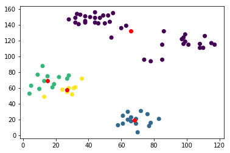
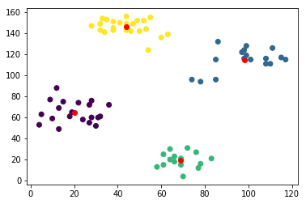
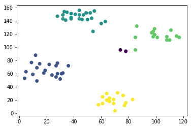

# Clustering with Kmeans and DBSCAN

The purpose of this project is to explore some clustering methods and apply them on datasets such as Ruspini dataset or the IRIS dataset. You can find in this repositiory a notebook explaining in details how we implment these methods.

## Kmeans algorithm

We first show in the notebook how to implement the K-means algorithm by ourselves without using Machine learning libraries, by considering a fixed number of clusters K, and by considering only one random initialization.
We obtain the following result:

Then we show how to use scikit-learn to implement this method and we try it on different initializations. This is the obtained result on a proper initialization.

Finally we run the K-Means method whith different values of K and compute the Silhoutte for each K in order to find out the best K.

Finally we do the same for the IRIS dataset and we find that the best K is 2 even if it's normally 3 for this dataset.

## DBSCAN algorithm

In this part, we apply first the DBSCAN on the Ruspini dataset using scikit-learn. We obtain the following result:

